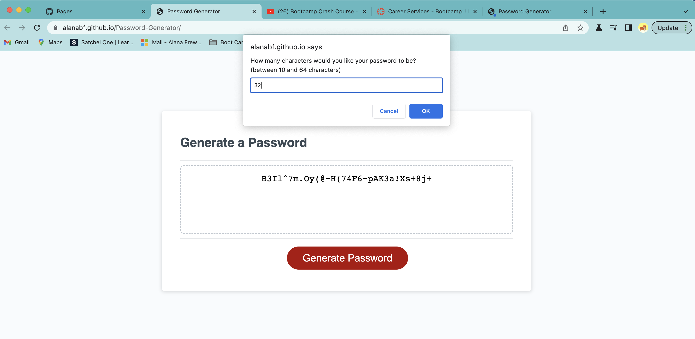

# Password-Generator

## Overview

 An application that an employee can use to generate a random password based on criteria they’ve selected. 
 
 * This app will run in the browser, and will feature dynamically updated HTML and CSS powered by JavaScript code. It has a clean and polished user interface that is responsive, ensuring that it adapts to multiple screen sizes. The password can include special characters.

 https://alanabf.github.io/Password-Generator/

## Functionality
 * Generate a password when the button is clicked
  * Present a series of prompts for password criteria
    * Length of password
      * At least 10 characters but no more than 64.
    * Character types
      * Lowercase
      * Uppercase
      * Numeric
      * Special characters ($@%&*, etc)
  * Code should validate for each input and at least one character type should be selected
  * Once prompts are answered then the password should be generated and displayed in an alert or written to the page

## Installation

This application runs in the browser. Follow the instructions on screen to generate a random password with your chosen characters choices; lowercase, uppercase, number and special.

## Usage

Javascript code is used to run through user choices and produce a random password that the user can copy and use as a password for anything. Being randomly generated makes it more difficult for the users password to be hacked.

## Technology Used

* JavaScript elements built to make the password function and meet the criteria.
* The DOM
* CSS and html files pre built.

## Credits

N/A

## License

MIT

---
